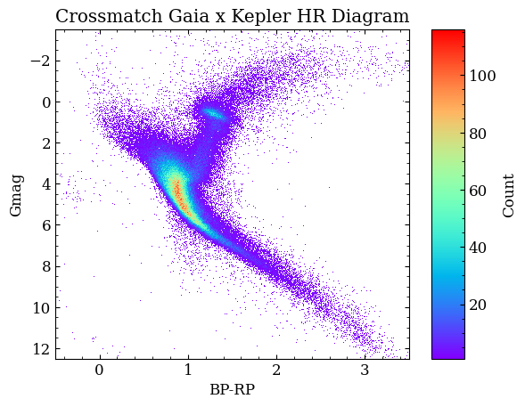

# CROSS MACTCH: GAIA X KEPLER
As bibliotecas a serem utilizadas nesse notebook serão *Numpy*, *Pandas*, *Matplotlib* e *Astropy*.

```
import numpy as np
import pandas as pd
import matplotlib.pyplot as plt
from astropy.table import Table
```

O objetivo do notebook é plotar um [[Diagrama Hertzsprung-Russell]] com "cross match" (cruzamento de dados) dos dados das missões Gaia e Kepler. O site [Gaia-Kepler.fun](https://gaia-kepler.fun/) disponibiliza o cruzamento dos dados dessas duas missões. 

Existem vários formas em que o cruzamento desses dados podem nos auxiliar. Um exemplo é no artigo Do Nascimento JR, J.-D. et al. (2020) onde foi usado para montar uma amostra de análogas solares com ajuda dos traços evolutivos.

Usando 1 arcseg, é só baixar a tabela no site e importar no notebook usando a função ``Tables`` do *Astropy*. Na minha máquina, o arquivo está no diretório definido como ``caminho``. 
```
## Importando arquivo
caminho = '/home/antenor/Documents/IC/Files/kepler_dr3_1arcsec.fits'
data = Table.read(caminho, format='fits')
```

Com o arquivo já importado, vamos selecionar as colunas que serão úteis no processo. Caso queira realizar mais análizes com outros dados, só procurar a documentação dos catálogos.
```
## Selecionando colunas
data = Table({'ra' : data['ra'], 
                    'dec' : data['dec'], 
                    'plx' : data['parallax'],
                    'mag' : data['phot_g_mean_mag'], 
                    'bp_rp' : data['bp_rp'], 
                    'source_id' : data['source_id']})
```

Calculando a magnitude absoluta, onde $M$ é a magnitude absoluta, $V$ relativa e $Plx$ a paralaxe:
$$M = V + 5 \cdot \log_{10}(\frac{Plx}{100})$$
```
## Magnitude absoluta
data['Gmag'] = data['mag'] + 5 * np.log10(data['plx']/100)
```

Alguns dados tendem para o infinito e para que possamos plotar a imagem, desconsideramos esses dados.
```
data = data.to_pandas()
data = data.replace([np.inf,-np.inf],np.nan).dropna()
```

Sendo assim, podemos visualizar o diagrama HR com o cruzamento dos dados do Gaia e Kepler:
```
x = data['bp_rp']
y = data['Gmag']
bins = 800

fig, ax = plt.subplots()

img = ax.hist2d(x, y, bins = bins, cmin = 1, cmap = 'rainbow')

fig.colorbar(img[3],label='Count', aspect=10, ax=ax)

ax.set_title('Crossmatch Gaia x Kepler HR Diagram')
ax.set_xlabel('BP-RP')
ax.set_ylabel('Gmag')
ax.set_xlim(-0.5, 3.5)
ax.set_ylim(12.5, -3.5)

plt.show()
```

# ANEXOS


# REFERÊNCIAS
- https://gaia-kepler.fun/
- DO NASCIMENTO JR, J.-D. et al. Rotation of Solar Analogs Crossmatching Kepler and Gaia DR2. The Astrophysical Journal, v. 898, n. 2, p. 173, 2020.
