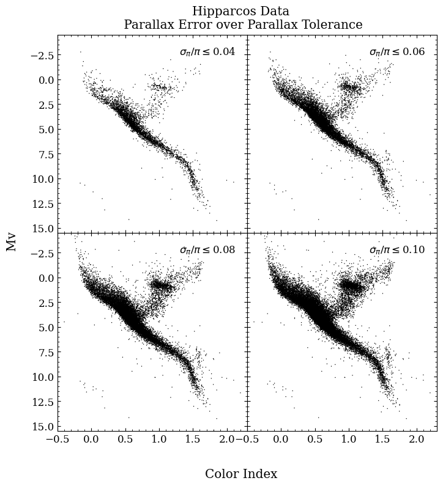

# DIAGRAMA HR - NOTEBOOK
O catálogo que iremos importar para nosso notebook será o "The Hipparcos and Tycho Catalogues (ESA 1997)". Foi proveniente da missão espacial da Agencia Espacial Europeia (ESA), no qual teve por objetivo a obtenção de dados astrométricos, como distância, paralaxe e movimento próprio de aproximadamente 118.000 estrelas com precisão de miliseguindos de arco. Lançado em agosto de 1989, o Hipparcos manteve-se operando até o fim da missão, em março de 1993. [1] Os obtidos foram divulgados e podem ser consultados através do site da ESA ou no Vizier.

Vizier é uma biblioteca online de catálogos no formato de tabelas de dados publicados em artigos e revistas científicas astronômicas. Até o presente momento fornece cerca de 24.735 catálogos disponíveis para consulta. Esses dados podem ser importados para o seu notebook através do pacote [Astroquery](https://astroquery.readthedocs.io/en/latest/) do Astropy.

Caso ainda não tenha tido contato com Astropy, sugiro consultar a documentação no [site](https://www.astropy.org/) para entendimento e instalação.

As bibliotecas que serão utilizadas nesse notebook serão:
```
import pandas as pd
import numpy as np
import matplotlib.pyplot as plt
from astroquery.vizier import Vizier
```

Primeiramente, para realizar a importação do catálogo, utilizaremos a função importada ```Vizier```. Para isso, devemos saber o caminho do catálogo, que neste caso é ```'I/239/hip_main'```, quantidade de linhas definida pela classe ```row_limit``` (caso queira importar todas as linhas use '-1') e as suas respectivas colunas a serem obtidas. Sempre coloque apenas as quantidades colunas necessárias, pois dependendo da massividade do catálogo, poderá afetar na velocidade do processamento das células. Por fim, converteremos a tabela para o formato Pandas.
 
```
colunas = Vizier(columns=['HIP', 'B-V', 'Vmag', 'Plx', 'e_Plx', 'RAhms', 'DEdms'], row_limit = -1)
data = colunas.get_catalogs('I/239/hip_main')[0]
data = data.to_pandas()
```


##  Equações

As equações aplicadas a seguir, dependem de um conhecimento técnico acerca do satélite e a forma como as informações são obtidas.

### Magnitude absoluta

Onde $M$ é a magnitude absoluta, $V$ a magnitude no filtro Johnson e $Plx$ a paralaxe.
$$M = V + 5 \cdot \log_{10}(\frac{Plx}{100})$$
```
data['Mv'] = data['Vmag'] + 5 * np.log10(data['Plx']/100.)
```

### Luminosidade
$$\log_{10}L = 4.83-V\cdot0.4$$
```
data['L'] =  10**((4.83 - data['Mv'])*0.4)
```

### Temperatura efetiva
$$Teff = 4600\cdot \bigg [ \normalsize \frac{1}{1.7 + 0.92\cdot (B-V)} + \frac{1}{0.62 + 0.92\cdot (B-V)}\bigg ]$$
```
data['Teff'] = 4600*((1/((0.92*data['B-V'])+1.7))+(1/((0.92*data['B-V'])+0.62)))
```


Após realizarmos os cálculos, não conseguiremos plotar os dados, pois podem haver colunas vazias, ou tendendo ao infinito. Essas informações foram desconsideradas da seguinte forma:
```
data = data.replace([0,[np.inf],[-np.inf],r'^\s*$'], np.nan, regex=True)
data = data.dropna()
```

Criaremos uma função que calculará e mascará o erro da paralaxe sobre a paralaxe, para podermos filtrar nos gráficos:
```
def filtro(dados,erro):
    dados['erro'] = dados['e_Plx']/dados['Plx']
    mask = dados['erro'] <= erro
    return dados[mask]
```

Podemos definir uma variável com um vetor que irá conter os erros a serem filtrados pela função acima. Aqui iremos considerar o $\sigma_{\pi}/\pi$ de $0.04$ a $0.10$ em intervalos de $0.02$. 
```
err = [0.04, 0.06, 0.08, 0.10] ## Erros da paralaxe sobre paralaxe a filtar
```

Sendo assim, já estamos aptos para plotar o gráfico:
```
fig, axs = plt.subplots(2, 2, figsize=(8, 8), sharex=True, sharey=True)
plt.subplots_adjust(wspace=0, hspace=0, top=0.92)

fig.suptitle('Hipparcos Data\n Parallax Error over Parallax Tolerance')
fig.supxlabel('Color Index')
fig.supylabel('Mv')

for i, ax in zip(err, axs.flatten()):
    x = filtro(data, i)['B-V']
    y = filtro(data, i)['Mv']
    ax.scatter(x, y, edgecolors='none', s=1, c='k')
    ax.set_xlim(-0.5, 2.3)
    ax.set_ylim(15.5, -4.5)
    ax.annotate(r'$\sigma_{\pi}/\pi \leq$'+ f'{ "{:.2f}".format(i) }', xy=(1.3, -2.5))
```

Agradecimentos ao contribuidor do blog Balbuceos Astropy de onde foi extraído grande parte do código acima.

# ANEXOS


# REFERÊNCIAS

- [1](https://www.cosmos.esa.int/web/hipparcos)**Home - Hipparcos - Cosmos**. Disponível em: <https://www.cosmos.esa.int/web/hipparcos>. (Consulta em 6 de fevereiro de 2024).
- Disponível em: http://balbuceosastropy.blogspot.com/2014/03/construction-of-hertzsprung-russell.html. (Consulta em 6 de fevereiro de 2024).
- Disponível em: https://astroquery.readthedocs.io/en/latest/vizier/vizier.html. (Consulta em 6 de fevereiro de 2024).
- Disponível em: https://www.cosmos.esa.int/web/hipparcos. (Consulta em 6 de fevereiro de 2024).
- SANDAGE, Allan; LUBIN, Lori M.; VANDENBERG, Don A. The Age of the Oldest Stars in the Local Galactic Disk from Hipparcos Parallaxes of G and K Subgiants1. Publications of the Astronomical Society of the Pacific, v. 115, n. 812, p. 1187, 2003.


‌